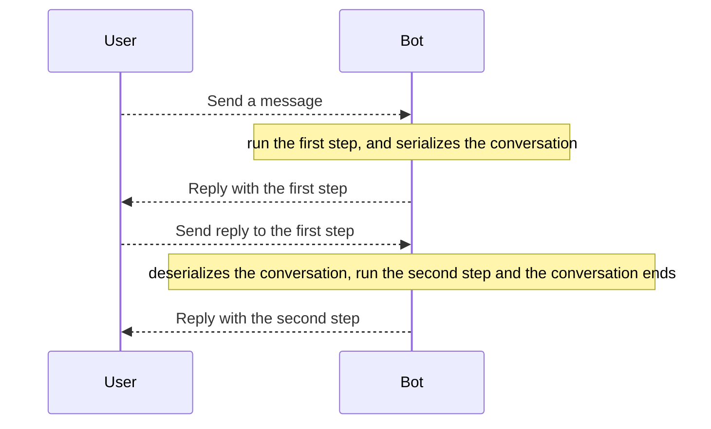

# Conversations

```warning
If you are using the `Webhook` update mode, you need some kind of persistent cache across requests to use this feature!
```

## Concept

Often, compared to a simple question and answer, you have to make the user perform a series of steps in a certain
sequence: the framework implements a **conversations system**, that allows you to create funnels with which you can make
your users perform a series of steps.



## Creating Conversations

To create a conversation, you must define a class that extends the framework `Conversation` class:

```php
use SergiX44\Nutgram\Conversations\Conversation;
use SergiX44\Nutgram\Nutgram;

class MyConversation extends Conversation {
    
    public function start(Nutgram $bot)
    {
        $bot->sendMessage('This is the first step!');
        $this->next('secondStep');    
    }
    
    public function secondStep(Nutgram $bot)
    {
        $bot->sendMessage('Bye!');
        $this->end();
    }
}

$bot = new Nutgram($_ENV['TOKEN']);

$bot->onCommand('start', MyConversation::class);

$bot->run();
```

- **Wait wait, whats going on here?**
    - When the user type *"/start"* for the first time, the first step of conversation is invoked, by default is
      the `start` method.
    - At the end of the first step, we define the next step of the conversation, setting the name of the next function,
      that will be **serialized to cache**.
    - In the second step, we are ending the conversation.

```note
If a conversation is not explicitly terminated with the `end()`, at the user next message will repeat the lastest saved step!
```

If you want to customize the name of the first step, you just need to override the `$step` property from conversation:

```php
use SergiX44\Nutgram\Conversations\Conversations\Conversation;
use SergiX44\Nutgram\Nutgram;

class MyConversation extends Conversation {
    
    protected ?string $step = 'myStart';
    
    public function myStart(Nutgram $bot)
    {
        $bot->sendMessage('This is the first step!');  
    }
    
    // ...
```

A more complete example:

```php
use SergiX44\Nutgram\Conversations\Conversation;
use SergiX44\Nutgram\Nutgram;

class AskIceCreamConversation extends Conversation {
    
    protected ?string $step = 'askCupSize';
    
    public $cupSize;
    
    public function askCupSize(Nutgram $bot)
    {
        $bot->sendMessage('How big should be you ice cream cup?', [
            'reply_markup' => json_encode([
                'inline_keyboard' => [
                    [
                        ['text' => 'Small', 'callback_data' => 'S'],
                        ['text' => 'Medium', 'callback_data' => 'M'],
                    ], [
                        ['text' => 'Big', 'callback_data' => 'L'],
                        ['text' => 'Super Big', 'callback_data' => 'XL'],
                    ],
                ],
            ])
        ]);
        $this->next('askFlavors');    
    }
    
    public function askFlavors(Nutgram $bot)
    {
        // if is not a callback query, ask again!
        if (!$bot->isCallbackQuery()) {
            $this->askCupSize($bot);
            return;
        }
        
        $this->cupSize = $bot->callbackQuery()->data;
    
        $bot->sendMessage('What flavors do you like?');
        $this->next('recap');
    }    
    
    public function recap(Nutgram $bot)
    {
        $flavors = $bot->message()->text;
        $bot->sendMessage("You want an $this->cupSize cup with this flavors: $flavors");
        $this->end();
    }
}
```

## Begin a Conversation

As you have already seen in the previous examples, conversation can be used in replacement for handlers:

```php
use SergiX44\Nutgram\StartConversation;
use SergiX44\Nutgram\Nutgram;

$bot = new Nutgram($_ENV['TOKEN']);

$bot->onCommand('start', StartConversation::class);

$bot->run();
```

But, you can also start a conversation at any time from another handlers, with the `begin` method:

```php
use SergiX44\Nutgram\StartConversation;
use SergiX44\Nutgram\Nutgram;

$bot = new Nutgram($_ENV['TOKEN']);

$bot->onCommand('start', function (Nutgram $bot) {
    // do stuff
    StartConversation::begin($bot); // the first step will be automatically fired
});

$bot->run();
```

## Funnel Escaping

By default, sends a message that match with a typed **specific** handler, the current conversation will be discarded, in
any case, it may be necessary to force the user inside a funnel (for example in a settings modification flow):

```php
use SergiX44\Nutgram\Conversations\Conversation;
use SergiX44\Nutgram\Nutgram;

class MyConversation extends Conversation {
    
    // ..
    
    public function step(Nutgram $bot)
    {
        $bot->sendMessage('This is the first step!');
        $this->setSkipHandlers(true)
            ->next('secondStep');    
    }
    
    // ..
}
```

In this way, your will force the next step execution.

## Middleware

By default, global middlewares are also applied before the conversation step, there may be situations, however, where
you want to be avoided (e.g. in a registration flow):

```php
use SergiX44\Nutgram\Conversations\Conversation;
use SergiX44\Nutgram\Nutgram;

class MyConversation extends Conversation {
    
    // ..
    
    public function step(Nutgram $bot)
    {
        $bot->sendMessage('This is the first step!');
        $this->setSkipMiddlewares(true)
            ->next('secondStep');    
    }
    
    // ..
}
```

In this way, your next step will be executed without any middleware before.

The two options before are also stackable:

```php
use SergiX44\Nutgram\Conversations\Conversation;
use SergiX44\Nutgram\Nutgram;

class MyConversation extends Conversation {
    
    // ..
    
    public function step(Nutgram $bot)
    {
        $bot->sendMessage('This is the first step!');
        $this->setSkipHandlers(true)
            ->setSkipMiddlewares(true)
            ->next('secondStep');    
    }
    
    // ..
}
```

## Procedural Usage

It's possible to start a conversation also without a OOP approach, in this way:

```php
use SergiX44\Nutgram\Nutgram;

$bot = new Nutgram($_ENV['TOKEN']);

$bot->onCommand('start', 'firstStep');


function firstStep(Nutgram $bot)
{
    // do stuff
    $bot->stepConversation('secondStep');
}

function secondStep(Nutgram $bot)
{
    // do stuff
    $bot->endConversation();
}

$bot->run();
```

```warning
Using conversations in this way, you will not be able to skip middlewares or skip handlers! 

By default, it will always allow funnel escaping and will always apply global middlewares.
```

## Inline Usage

For very short conversations, you can also define the next step as a closure, with the same limitations of the
procedural usage:

```php
use SergiX44\Nutgram\Nutgram;

$bot = new Nutgram($_ENV['TOKEN']);

$bot->onCommand('start', function (Nutgram $bot) {
    // step one
    $bot->stepConversation(function (Nutgram $bot){
        // step two
        $bot->endConversation();
    });
});

$bot->run();
```
