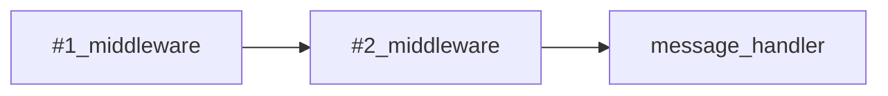

# Handlers

## Concept

The framework provides to you a nice API event-like to handling incoming updates:

```php
use SergiX44\Nutgram\Nutgram;

$bot = new Nutgram($_ENV['TOKEN']);

$bot->onMessage(function (Nutgram $bot) {
    $bot->sendMessage('You sent a message!');
});

$bot->run();
```

Every `->on*` handler is called based on the update type defined
in [Telegram's update object](https://core.telegram.org/bots/api#update), there are also some specific handlers, which
may respond based on specific patterns or types of messages.

As you can also see from the example above, some required parameters (like the `chat_id`) can be **omitted**, while the
bot is in the context of managing an update, so those fields **are automatically extracted from the current update**.

Of course, **you can override them at any time**, simply by specifying them in the `$opt` array.

## Middleware

In the framework context, any handler is threaded like a **link of chain**, so you can easily link together multiple
handlers (middlewares).

```php
use SergiX44\Nutgram\Nutgram;

$bot = new Nutgram($_ENV['TOKEN']);

$bot->middleware(function (Nutgram $bot, $next) {
    $bot->sendMessage('I\'m the #1 middleware!!');
    $next($bot);
});

$bot->onMessage(function (Nutgram $bot) {
    $bot->sendMessage('I\'m the message handler!!');
})->middleware(function (Nutgram $bot, $next) {
    $bot->sendMessage('I\'m the #2 middleware!!');
    $next($bot);
});

$bot->run();
```

In the example above, the sequence of the calls is



The call to `$next($bot)` is needed to proceed through the chain, where `$next` is the next callable, passing the
current instance of the bot. It is possible at any point to stop the execution of the chain, returning from the
function, or not calling the method `$next($bot)`:

```php
use SergiX44\Nutgram\Nutgram;

$bot = new Nutgram($_ENV['TOKEN']);;

$bot->onMessage(function (Nutgram $bot) {
    $bot->sendMessage('I will be never called :(');
})->middleware(function (Nutgram $bot, $next) {
    $bot->sendMessage('Stop!');
    //$next($bot);
});

$bot->run();
```

## OOP

So far you have seen handlers defined only as closures. But the framework, any definition that accepts a closure, also
accepts a class-method definition, or invocable classes, like this:

```php
use SergiX44\Nutgram\Nutgram;

class MyMiddleware {
    public function __invoke(Nutgram $bot, $next) {
      //do stuff
      $next($bot);
    }
}
```

```php
use SergiX44\Nutgram\Nutgram;

class MyCommand {
    public function __invoke(Nutgram $bot, $param) {
      //do stuff
    }
}
```

```php
use SergiX44\Nutgram\Nutgram;

$bot = new Nutgram($_ENV['TOKEN']);;

$bot->onCommand('start {param}', MyCommand::class)
    ->middleware(MyMiddleware::class);

$bot->run();
```

## Specific handlers

### Commands

It's possible to listen to specific commands, also with named parameters:

```php
use SergiX44\Nutgram\Nutgram;

$bot = new Nutgram($_ENV['TOKEN']);

// Called when a message contains the command "/start someParameter"
$bot->onCommand('start {parameter}', function (Nutgram $bot, $parameter) {
    $bot->sendMessage("The parameter is {$parameter}");
});

// Called on command "/help"
$bot->onCommand('help', function (Nutgram $bot) {
   $bot->sendMessage('Help me!');
});

$bot->run();
```

## Update Helpers

## Available Handlers

```danger
This documentation page is currently under development!
```