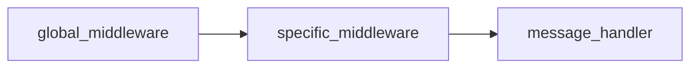

# Middleware

In the framework context, any handler is threaded like a **link of chain**, so you can easily link together multiple
handlers (middlewares). It applies the same concept that frameworks like Laravel have, allowing you to leverage them to
separate repeated logic, or perform checks before executing a message handler.

```php
use SergiX44\Nutgram\Nutgram;

$bot = new Nutgram($_ENV['TOKEN']);

// global middleware
$bot->middleware(function (Nutgram $bot, $next) {
    $bot->sendMessage('I\'m the global middleware!!');
    $next($bot);
});

$bot->onMessage(function (Nutgram $bot) {
    $bot->sendMessage('I\'m the message handler!!');
})->middleware(function (Nutgram $bot, $next) {

    $bot->sendMessage('I\'m the specific middleware!!');
    $next($bot);
});

$bot->run();
```

In the example above, the sequence of the calls is



As the name says, the `global middleware` will be called before *every* message middleware of every handler (or before
every handler if no middleware specified). The `specific middleware` will be called only before the `message handler`.

The call to `$next($bot)` is needed to proceed through the chain, where `$next` is the next callable, passing the
current instance of the bot. It is possible at any point to stop the execution of the chain, returning from the
function, or not calling the method `$next($bot)`:

```php
use SergiX44\Nutgram\Nutgram;

$bot = new Nutgram($_ENV['TOKEN']);

$bot->onMessage(function (Nutgram $bot) {
    $bot->sendMessage('I will be never called :(');
})->middleware(function (Nutgram $bot, $next) {

    $bot->sendMessage('Stop!');
    //$next($bot);
});

$bot->run();
```

## Passing data

It's possible to pass data between middlewares, using the method `setData` and `getData` on the bot instance, for
example, to automatically retrieve data from a database, perform checks, and so on:

```php
use SergiX44\Nutgram\Nutgram;

$bot = new Nutgram($_ENV['TOKEN']);

// retrieve the user
$bot->middleware(function (Nutgram $bot, $next) {
    $user = get_current_user_from_db($bot->userId());
    $bot->setData('user', $user);
    $next($bot);
});


$bot->onCommand('admin', function (Nutgram $bot) {

    $user = $bot->getData('user');
    $bot->sendMessage("Hi admin $user->name!");
    
})->middleware(function (Nutgram $bot, $next) {

    $user = $bot->getData('user'); // retrieve the user we have set in the global middleware
    if ($user->isAdmin) { // if the user is an admin, continue the chain
        $next($bot);
    }
    $bot->sendMessage('You are not an admin >:(');
});

$bot->onCommand('user', function (Nutgram $bot) {
    $user = $bot->getData('user');
    $bot->sendMessage("Hi user $user->name!");
});

$bot->run();
```

## OOP

Also in this case, all the `$callable` can be also defined as class-method or invokable class:

```php
use SergiX44\Nutgram\Nutgram;

class MyMiddleware {

    public function __invoke(Nutgram $bot, $next) 
    {
      //do stuff
      $next($bot);
    }
}
```

```php
use SergiX44\Nutgram\Nutgram;

class MyCommand {

    public function __invoke(Nutgram $bot, $param) 
    {
      //do stuff
    }
}
```

```php
use SergiX44\Nutgram\Nutgram;

$bot = new Nutgram($_ENV['TOKEN']);

$bot->onCommand('start {param}', MyCommand::class)
    ->middleware(MyMiddleware::class);

$bot->run();
```